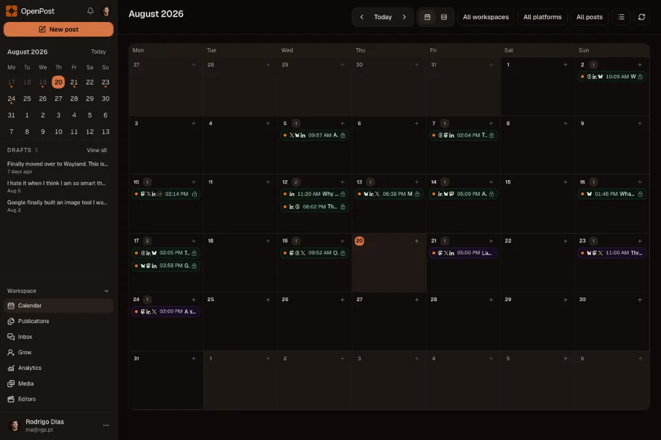
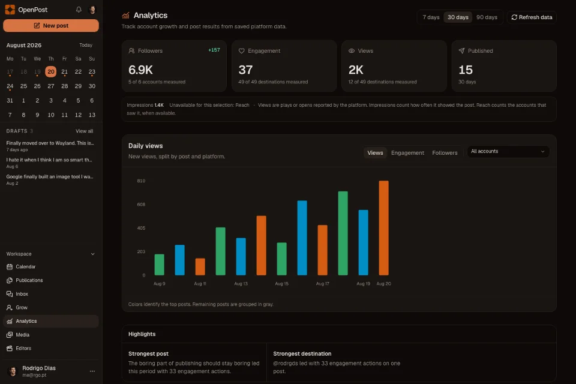
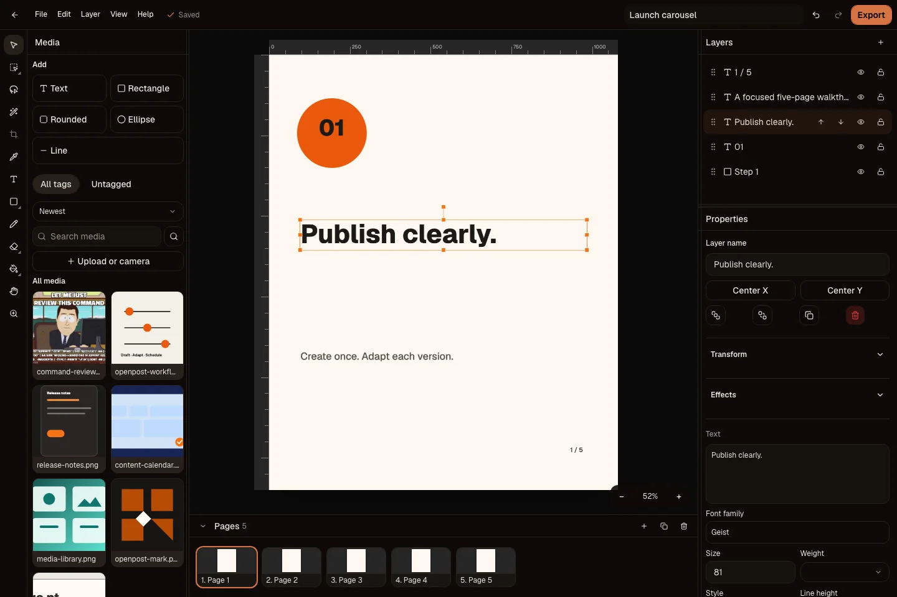
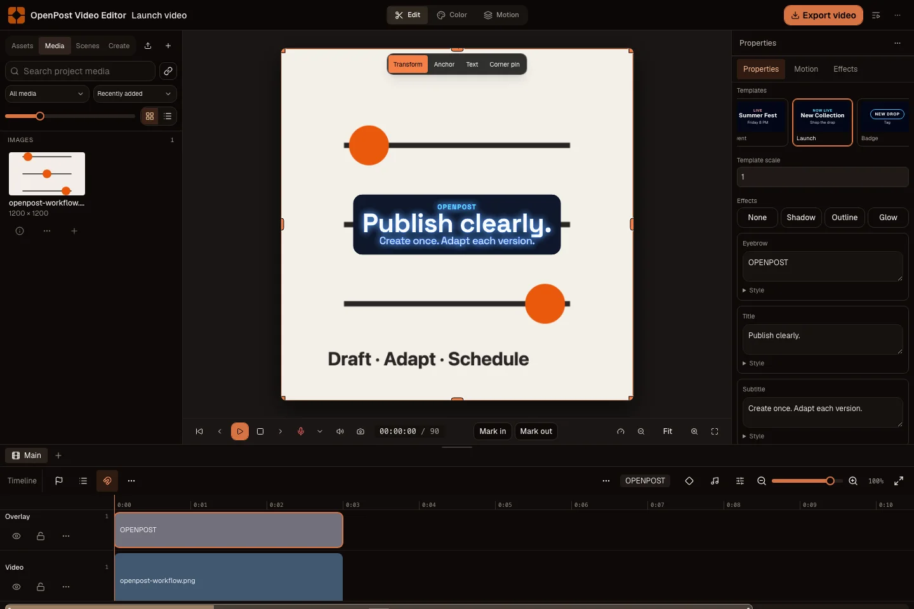
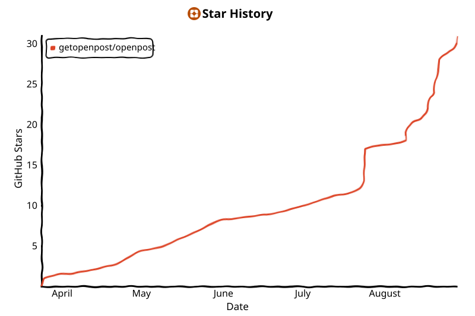

  <a href="https://openpost.social">
    <picture>
      <source media="(prefers-color-scheme: dark)" srcset="./assets/brand/lockup-dark.svg">
      <source media="(prefers-color-scheme: light)" srcset="./assets/brand/lockup.svg">
      
    </picture>
  </a>

  <strong>Your socials, on steroids.</strong>
   
  Write it once. Make it fit. Pick a time. See what worked.

  
  
  

  <a href="https://app.openpost.social/register?plan=founder&amp;billing_period=monthly"><strong>Start 14-day trial</strong></a>
  ·
  <a href="https://docs.openpost.social/guide/quickstart"><strong>Run your own</strong></a>
  ·
  <a href="https://docs.openpost.social"><strong>Docs</strong></a>
  ·
  <a href="https://discord.gg/u2QwukmY4W"><strong>Discord</strong></a>

  

Make something worth sharing. OpenPost helps you shape it for every social app, send it at the right time, and see what happened.

<table>
  <tr>
    <td width="50%" align="center">
      
       Calendar
    </td>
    <td width="50%" align="center">
      
       Results
    </td>
  </tr>
</table>

<table>
  <tr>
    <td width="50%" align="center">
      
       Image Editor
    </td>
    <td width="50%" align="center">
      
       Video Editor
    </td>
  </tr>
</table>

## Make it. Share it. Keep moving.

- Write one post, then make it fit each social app.
- Add pictures, clips, and links.
- Put posts on the calendar.
- Make images, cut videos, and make memes.
- See what went out, what failed, and what people liked.
- Read and answer comments.

OpenPost is for posting. It does not run your ads or track every mention of your name.

## Start posting

Try [OpenPost](https://app.openpost.social). We run it for you.

Want your own copy? [Follow the setup guide](https://docs.openpost.social/guide/quickstart).

[Setup help](https://docs.openpost.social/self-hosting/) · [Which one is right for me?](https://openpost.social/self-hosting)

## Where you can post

OpenPost is built for X, Mastodon, Bluesky, LinkedIn, Threads, Facebook Pages, Instagram, TikTok, YouTube, and Discord.

Each social app has its own rules. Some must approve OpenPost first. Others need a certain kind of account. OpenPost tells you what is missing before you post.

<!-- provider-certification:begin -->

No posting option has passed our final live check on OpenPost Hosted yet.

A social app can appear in OpenPost before it is ready for real accounts.
<!-- provider-certification:end -->

[See what works today](https://docs.openpost.social/operations/provider-launch-matrix) · [See each app's rules](https://docs.openpost.social/providers/)

## Make it yours

OpenPost is open source. Run your own copy, build something with it, or help make it better.

[Run your own copy](https://docs.openpost.social/guide/quickstart) · [Build with OpenPost](https://docs.openpost.social/development/api-reference) · [Help improve OpenPost](CONTRIBUTING.md)

## Help OpenPost grow

If OpenPost saves you time, **give it a star**. It helps more people find it.

<!-- star-history:start -->
<picture>
  <source media="(prefers-color-scheme: dark)" srcset="assets/star-history/star-history-dark.svg">
  
</picture>
<!-- star-history:end -->

## License and safety

OpenPost is open source under the [AGPL-3.0-only license](LICENSE). Found a safety problem? Tell us privately through the [security policy](SECURITY.md).
