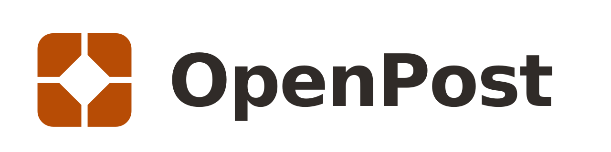
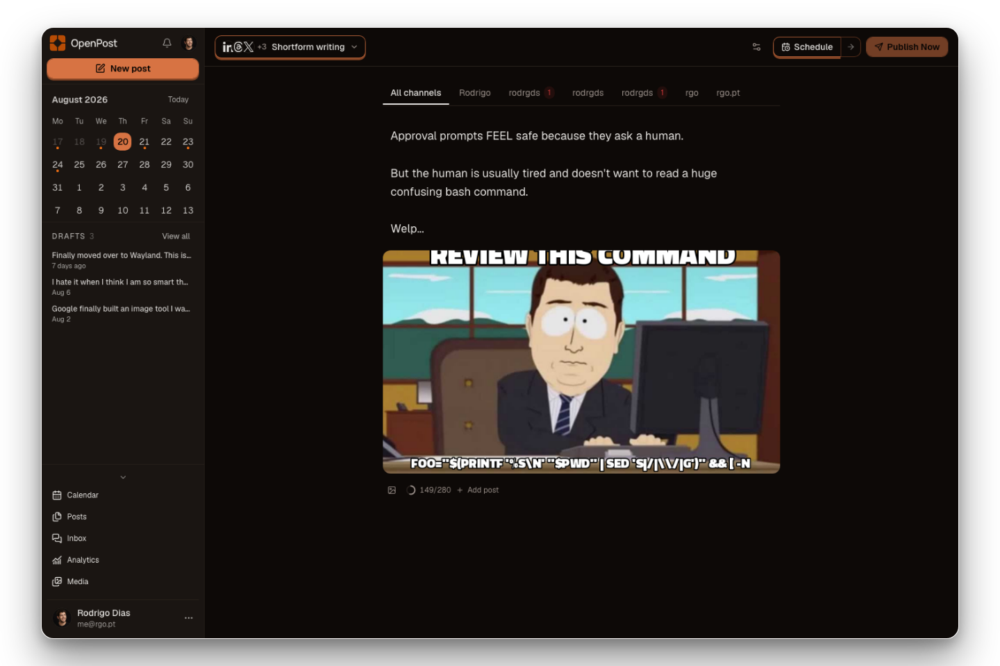
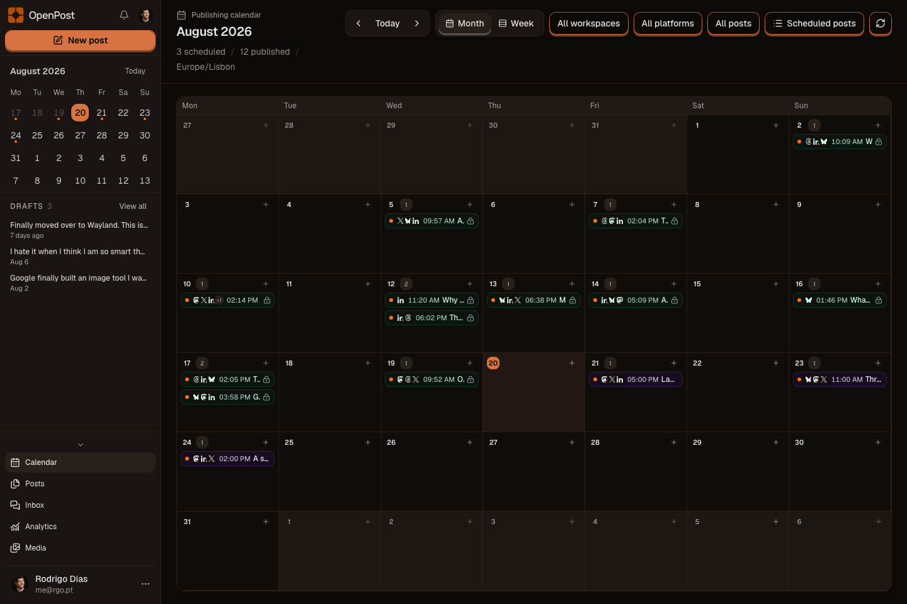
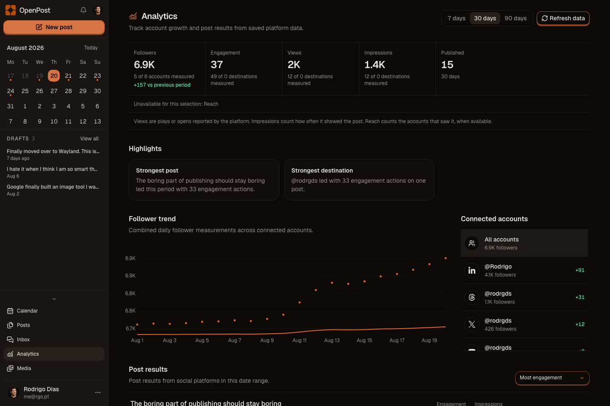
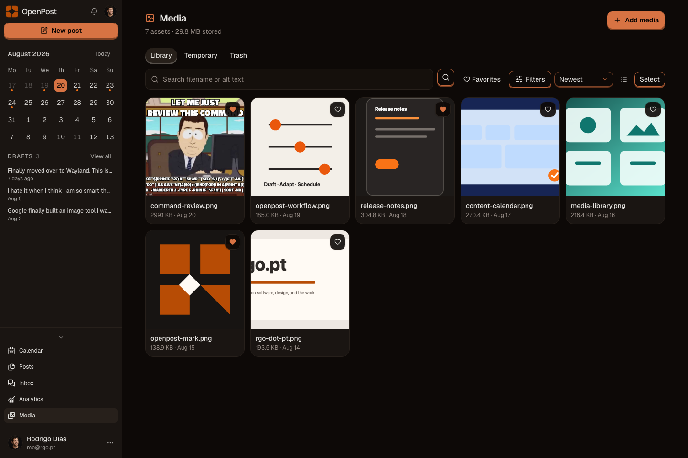
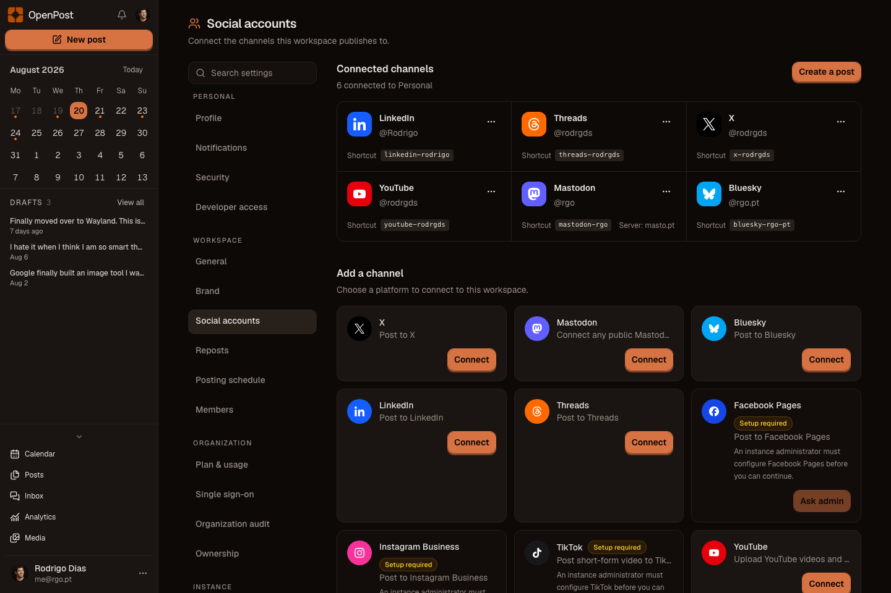

<p align="center">
  <a href="https://openpost.social">
    <picture>
      <source media="(prefers-color-scheme: dark)" srcset="./assets/brand/lockup-dark.svg">
      <source media="(prefers-color-scheme: light)" srcset="./assets/brand/lockup.svg">
      
    </picture>
  </a>
</p>

<p align="center">
  <strong>Write once. Shape every channel. Know what shipped.</strong>
  <br>
  One social publishing workspace for founders, creators, teams, and agencies.
</p>

<p align="center">
  <a href="https://github.com/getopenpost/openpost/releases">
    <picture>
      <source media="(prefers-color-scheme: dark)" srcset="https://shieldcn.dev/github/release/getopenpost/openpost.svg?variant=outline&amp;size=sm&amp;font=geist&amp;mode=dark">
      
    </picture>
  </a>
  <a href="https://github.com/getopenpost/openpost/actions/workflows/ci.yml">
    <picture>
      <source media="(prefers-color-scheme: dark)" srcset="https://shieldcn.dev/github/ci/getopenpost/openpost.svg?variant=outline&amp;size=sm&amp;font=geist&amp;mode=dark">
      
    </picture>
  </a>
  <a href="https://github.com/getopenpost/openpost">
    <picture>
      <source media="(prefers-color-scheme: dark)" srcset="https://shieldcn.dev/github/stars/getopenpost/openpost.svg?variant=outline&amp;size=sm&amp;font=geist&amp;mode=dark">
      
    </picture>
  </a>
  <a href="https://github.com/getopenpost/openpost/releases">
    <picture>
      <source media="(prefers-color-scheme: dark)" srcset="https://shieldcn.dev/github/downloads/getopenpost/openpost.svg?variant=outline&amp;size=sm&amp;font=geist&amp;mode=dark">
      
    </picture>
  </a>
</p>

<p align="center">
  <a href="https://app.openpost.social/register?plan=founder&amp;billing_period=monthly"><strong>Start a 14-day trial</strong></a>
  ·
  <a href="https://docs.openpost.social/guide/quickstart"><strong>Self-host</strong></a>
  ·
  <a href="https://docs.openpost.social"><strong>Docs</strong></a>
  ·
  <a href="https://discord.gg/u2QwukmY4W"><strong>Discord</strong></a>
</p>

<p align="center">
  
</p>

OpenPost starts with the work you already have: launches, updates, lessons, and ideas. Turn it into channel-ready posts, keep every destination's rules visible, schedule the result, and see what happened after it shipped.

<table>
  <tr>
    <td width="50%" align="center">
      
      <br><strong>Plan the month</strong><br><sub>Drafts, scheduled posts, and published work stay in one calendar.</sub>
    </td>
    <td width="50%" align="center">
      
      <br><strong>See what worked</strong><br><sub>Track real provider metrics without mixing views, impressions, and reach.</sub>
    </td>
  </tr>
  <tr>
    <td width="50%" align="center">
      
      <br><strong>Reuse your brand</strong><br><sub>Keep images, videos, designs, and their usage in the shared library.</sub>
    </td>
    <td width="50%" align="center">
      
      <br><strong>Keep provider truth visible</strong><br><sub>Connect each channel once, then see its real setup and publishing state.</sub>
    </td>
  </tr>
</table>

<p align="center"><sub>These images come from the current app with deterministic demo data. Run <code>bun run capture:product-screenshots</code> to rebuild every screenshot.</sub></p>

## What OpenPost gives you

- **A destination-aware composer.** Write a post, thread, story, short video, or video, then adapt text, media, format, timing, and provider settings per account.
- **A durable publishing queue.** Scheduled work lives in the database, survives restarts, and keeps clear queued, published, failed, and retrying states.
- **A real content inventory.** Publications, renditions, Social Sets, media, the calendar, analytics, engagement, and inbox all share one workspace boundary.
- **Creative tools where the work happens.** Edit images, build memes, cut social video, draft image descriptions, and save the result back to Media.
- **One product across every surface.** The web app, Android wrapper, HTTP API, CLI, and MCP server use the same terms, access rules, and saved state.

OpenPost does not include a CRM, ad manager, social listening, or large-company benchmarks. The Hosted service is the main product. Self-hosting is a deployment option where you own the server, updates, backups, provider projects, and support.

## Get started

Use the [Hosted service](https://app.openpost.social) if you want OpenPost managed for you.

To run it yourself:

```bash
git clone https://github.com/getopenpost/openpost.git
cd openpost
cp .env.example .env
# Set OPENPOST_APP_URL and replace the two example secrets in .env.
docker compose up -d
```

Open `http://localhost:8080`, create the first account, and connect a social account. The default setup uses one container, SQLite, local media, and database-backed jobs. The current amd64 image is published at [`ghcr.io/getopenpost/openpost`](https://github.com/getopenpost/openpost/pkgs/container/openpost).

[Read the self-hosting quickstart](https://docs.openpost.social/guide/quickstart) · [Installation reference](https://docs.openpost.social/self-hosting/) · [Hosted and self-hosted boundary](https://openpost.social/self-hosted)

## Providers

OpenPost includes adapters for X, Mastodon, Bluesky, LinkedIn profiles and Organization Pages, Threads, Facebook Pages, Instagram Business and Creator accounts, TikTok, YouTube, and Discord webhooks.

An adapter proves implementation, not Hosted readiness. App review, account access, scopes, policy mode, runtime controls, and live certification stay separate.

<!-- provider-certification:begin -->

The checked-in public certification manifest contains **0 exact provider-format claims**.

No Hosted service provider-format certification claim is current. Implementation descriptions do not assert Hosted service availability.
<!-- provider-certification:end -->

[Provider readiness](https://docs.openpost.social/providers/launch-matrix) · [Platform limits](https://docs.openpost.social/providers/platform-limits)

## Automate it

OpenPost tokens let the typed HTTP API, CLI, and MCP server work inside the same workspace and permission boundaries as the app. Automation can prepare and publish content without exposing social account keys.

[CLI guide](https://docs.openpost.social/cli/) · [MCP guide](https://docs.openpost.social/mcp/) · [API reference](https://docs.openpost.social/reference/api)

## Develop OpenPost

OpenPost uses Go, Svelte 5, SvelteKit, Bun, and Devenv.

```bash
direnv allow
devenv shell -- setup
bun run verify
```

Read [CONTRIBUTING.md](CONTRIBUTING.md) and the [development docs](https://docs.openpost.social/development/setup) before opening a pull request.

## License and security

OpenPost is licensed under [AGPL-3.0-only](LICENSE). Report vulnerabilities privately through the [security policy](SECURITY.md).
